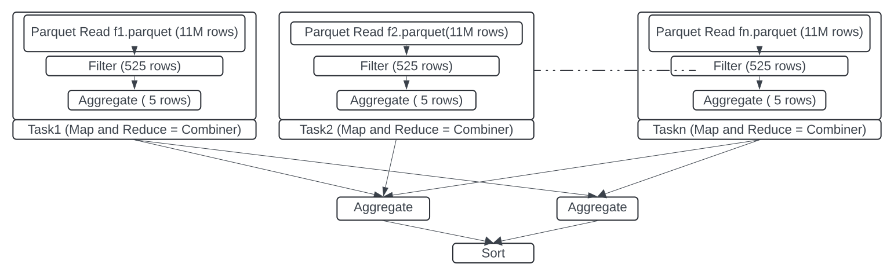
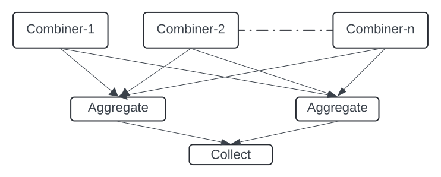
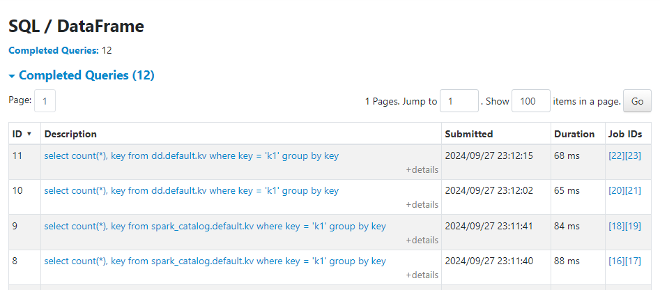
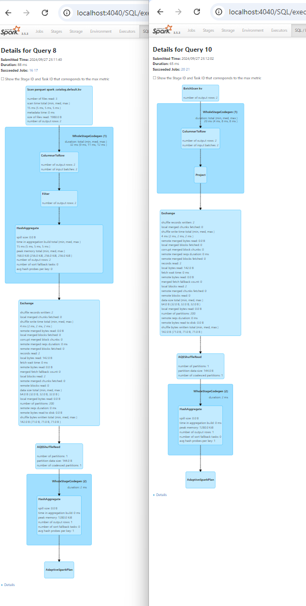

# 1 Introduction

Lets analyze a typical query which has filter, project and aggregation.\
`select sum(quantities_on_hand), warehouse_id from inventory where item_id = 123 group by warehouse_id`\
where table `inventory` has schema `(date date, item_id int, warehouse_id int, quantity_on_hand int)`.\
This query returns warehouse and sum of quantity on hand for an item_id 123.\ 
This is how execution DAG for this query would look like

\
1. First query engine would identify relevant parquet files. This step is generally executed on the master. 
2. Next execution engine would create multiple tasks based on the total size of relevant file. Each task would independently work on roughly 128MB of parquet files 
3. Each task would read column chunks based on projection (item_id, warehouse_id, quantity_on_hamd)
4. Next filter(item_id = 123) would be executed on each task
5. On those filtered rows aggregation will be performed. 
6. Those aggregated (combined) data will be shuffled for further aggregation
7. Finally sort will be performed to produce the result.

A Table may have TBs of data but relevant in files data for the query will be only few GBs which is read from the disk and after project, filter and combine this data is reduced to few MBs or KBs before its sent for shuffle.
Step 3,4,5 can be attributed to CPU as well as time because disk read. They are also the steps which benefits the most from parallel processing.
Step 1 and 2 are generally performed on the master
Step 6 and 7 are again performed on executors. They can also be performed on master.

This project decouples combiner steps (step 3,4 and 5) from rest of the query execution.
\
The combiner is implemented using DuckDB. It can exist inside executor process or outside as a standalone web server
Inside the executor process combiner and executors communicate using arrow C-Data interface.  
If combiner is deployed as a standalone server protocol between combiner and executor is rest interface using arrow-ipc over http\

Decoupling combiner with rest of the query engine would have several benefits

1. Stateless Combiner : 
2. Deployment : This architecture has possibilities restricted only by your imagination such as federated data access involving multiple clouds or flexible load balancing
3. Pluggability : Over the past few year Apache Arrow is becoming standard format to share columnar data for efficient data processing. Same combiner implementation can be plugged to different SQL processing engine such as DuckDB and Trino
4. Performance : Because of arrow exchange format and efficient c++ processing of DuckDB most of the processing engine will see improvement in performance. Remote deployment will see little performance drop since it might introduce network latency however this deployment will alleviate the need to have a distribute cluster which would offset latency introduced by the network.
5. Streaming Reduce : Because execution engines would delegate combining task, it will be possible to execute streaming reduce on a single not with small amount of memory and disk in case of a spill  


## Getting started

- Create package <br> `/mvnw package -DskipTest`
- Change dir to SPARK_HOME <br> `cd $SPARK_HOME`
- Start spark-sql with following command. 
  ```
  bin/spark-sql  --conf spark.jars.packages=org.duckdb:duckdb_jdbc:1.1.1 \
  --conf spark.jars=<path_of_git_repo>/connector-spark/target/connector-spark-0.0.1-jar-with-dependencies.jar \ 
  --conf spark.sql.catalog.dd=io.dazzleduck.combiner.catalog.CatalogImpl \
  --conf spark.sql.extensions=io.dazzleduck.combiner.connector.spark.extension.DDExtensions```

- Create table <br> `create table spark_catalog.default.kv(key string, value string) using parquet location '/tmp/kv'; `
- Insert values <br> `insert into table spark_catalog.default.kv values ('k1', 'v1'), ('k2', 'v2'), ('k1', 'v3') `
- Validate count <br> `select count(*) from spark_catalog.default.kv`
- Create table inside `dd` catalog. <br> `create table dd.default.kv (key string, value string) using parquet location '/tmp/kv'`
- Validate count <br> `select count(*) from dd.default.kv`
- Lets run some aggregation and filter for dd tables <br> `select count(*), key from dd.default.kv where key = 'k1' group by key ;`
- Lets run some aggregation and filter for dd tables <br> `select count(*), key from spark_catalog.default.kv where key = 'k1' group by key ;`
- You can see the difference is timing as well as execution plan

\
\