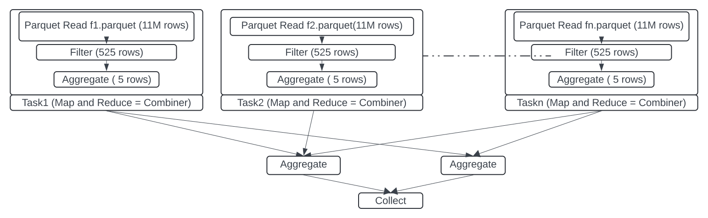

# 1 Introduction
DazzleDuck = Dazzle (Spark) + Duck (DuckDB)\
**Apache Spark™** is a multi-language engine for executing data engineering, data science, and machine learning on single-node machines or clusters.\
**DuckDB** is a fast in-process analytical database. DuckDB runs analytical queries at blazing speed thanks to its columnar engine, which supports parallel execution and can process larger-than-memory workloads\
The objective of this project is to **accelerate** and **modularize** spark sql execution using vectorized processing of DuckDB.\
These accelerated and modularized components can be reused across multiple execution engines such as Trino and DuckDB itself. \     

Let's analyze a typical query involving filter, project and aggregation.\
`select sum(quantities_on_hand), warehouse_id from inventory where item_id = 123 group by warehouse_id`\
The table `inventory` has schema
```
    | date date,
    | item_id int,
    | warehouse_id int,
    | quantity_on_hand int
```
This query returns warehouse and sum of quantity on hand for an item_id 123.\
Below is the execution DAG for this query. 




***Query Engine Workflow***

The query engine workflow involves several steps to efficiently process large datasets stored in parquet files.

1. **Master Node**: The first step is executed on the master node, where the relevant parquet files are
   identified based on query filters
2. **Task Creation**: The execution engine creates stages and tasks based on the identified relevant
   files. This query would require two stages. 
3. **Combiner Stage ( Map and local Reduce)**: It's a combination of column chunk reading, applying filter and Aggregation. This stage is referred as combine in Map Reduce Framework.
   Stage 1 would generally execute as part of multiple tasks. Each task would independently work on roughly 128MB of parquet files, reading column chunks, applying the filter and aggregating data
4. **Reduce Stage** Before execution of this stage data is shuffled based on aggregation key `warehouse_id`. On the shuffled data aggregation is performed to produce the final result
5. **Collect**: Data is collected on the master. 

A table may have TBs of data across thousands of files. Of those thousands of files only few files will be relevant.
Of those relevant files only few chunks would contain actual data that need to read from disk. This data in further reduced by the aggregate operation in step 5
Tasks in **Combiner stage** would read GB of data and reduce it to MBs or KBs
This stage can be also be attributed to CPU as well as time because disk read. They are also the steps which benefits the most from parallel processing.

This project decouples **Combiner Stage** from rest of the query execution. Combiner state is implemented using DuckDB which also serves as accelerator for those ubiquitous and resource intensive tasks in **Combiner Stage** .
\
Ths combiner can exist inside executor process or outside at some remote location as a standalone web server
Inside the executor process combiner and executors communicate using arrow C-Data interface.
If combiner is deployed as a standalone server, protocol between combiner and executor is REST using arrow-ipc over http

Decoupling combiner with rest of the query engine would have several benefits

1. Stateless Combiner : Combiner does not need to maintain any state. It receives the request and respond to it without maintaining any state across request.
2. Deployment : This architecture can serve building block for true Data Mesh. Not only exchanges among mesh endpoints are efficient because of arrow data format, the amount of data exchanged would be significantly reduced  
3. Pluggability : Same combiner implementation can be plugged to different SQL processing engine such as DuckDB and Trino
4. Performance : Because of arrow exchange format and efficient c++ processing of DuckDB most of the processing engine will see improvement in performance. Remote deployment will see little performance drop since it might introduce network latency however this deployment will alleviate the need to have a distribute cluster which would offset latency introduced by the network.
5. Streaming Reduce : Because execution engines would delegate combining task, it will be possible to execute streaming reduce on a single not with small amount of memory and disk in case of a spill  


## Getting started.
### Combiner and executor in the same process.

- Create package <br> `/mvnw package -DskipTest`
- Change dir to SPARK_HOME <br> `cd $SPARK_HOME`
- Start spark-sql with following command. 
  ```
  bin/spark-sql  --conf spark.jars.packages=org.duckdb:duckdb_jdbc:1.1.1 \
  --conf spark.jars=<path_of_git_repo>/connector-spark/target/connector-spark-0.0.1-jar-with-dependencies.jar \ 
  --conf spark.sql.catalog.dd=io.dazzleduck.combiner.catalog.CatalogImpl \
  --conf spark.sql.extensions=io.dazzleduck.combiner.connector.spark.extension.DDExtensions
  ```

- Create table <br> `create table spark_catalog.default.kv(key string, value string) using parquet location '/tmp/kv'; `
- Insert values <br> `insert into table spark_catalog.default.kv values ('k1', 'v1'), ('k2', 'v2'), ('k1', 'v3') `
- Validate count <br> `select count(*) from spark_catalog.default.kv`
- Create table inside `dd` catalog. <br> `create table dd.default.kv (key string, value string) using parquet location '/tmp/kv'`
- Validate count <br> `select count(*) from dd.default.kv`
- Lets run some aggregation and filter for dd tables <br> `select count(*), key from dd.default.kv where key = 'k1' group by key ;`
- Lets run some aggregation and filter for dd tables <br> `select count(*), key from spark_catalog.default.kv where key = 'k1' group by key ;`
- You can see the difference is timing as well as execution plan

\
\

### Setting up Combiner in the Remote Mode
In this mode combiner will be running in a separate docker container and execute combine stage.
- Build combiner server docker.
  ```../mvnw package -Dpackaging=docker -DskipTests```
- Start minio docker.
  ``` docker run --name minio --network="host" -v /tmp/minio:/data    quay.io/minio/minio server /data --console-address ":9001"```\
- Run combiner container
  ```docker run --name server -p 8080:8080  --network="host" server```
- Test server is running fine by creating a series. This will create series.arrow file
  ``` curl -v --output s.arrow -H "X-QueryId: 123" http://localhost:8080/v1/q/series?size=100```
- Configure spark to be able to connect to connect to minio.
  ```cd <SPARK_HOME>```
  ```cp conf/spark-defaults.conf.template conf/spark-defaults.conf```
-  Append the content to `conf/spark-default.conf` directory. 
  ```
spark.driver.memory              5g
spark.hadoop.fs.s3a.access.key minioadmin
spark.hadoop.fs.s3a.secret.key minioadmin
spark.hadoop.fs.s3a.endpoint http://localhost:9000
spark.hadoop.fs.s3a.path.style.access true
spark.hadoop.fs.s3a.connection.ssl.enabled false
spark.hadoop.fs.s3a.impl  org.apache.hadoop.fs.s3a.S3AFileSystem
spark.hadoop.fs.s3a.connection.ssl.enabled  false
spark.hadoop.fs.defaultFS s3a://spark
spark.sql.extensions=io.dazzleduck.combiner.connector.spark.extension.DDExtensions
  ```
- Download aws jar files ` aws-java-sdk-bundle-1.12.770.jar` and `hadoop-aws-3.3.4.jar` from maven repo and copy them in `<SPARK_HOME>/jars` directory
- Run spark
  ```
  bin/spark-sql --conf spark.jars.packages=org.duckdb:duckdb_jdbc:1.1.1 \
  --conf spark.jars=<path_of_git_repo>/connector-spark/target/connector-spark-0.0.1-jar-with-dependencies.jar \ 
  ```
- Create table `create table spark_catalog.default.kv_s3(key string, value string) using parquet location '/kv_s3'`
- Insert Data ` insert into table spark_catalog.default.kv_s3 values ('k1', 'v1'), ('k2', 'v2'), ('k1', 'v3')`
- Create table to use combiner `create table dd.default.kv_s3 (key string, value string) using parquet options ('path' = 's3a://spark/kv_s3', 'url'='http://localhost:8080/v1/q/parquet', 's3_endpoint
'='localhost:9000');`

Difference in timing
\
